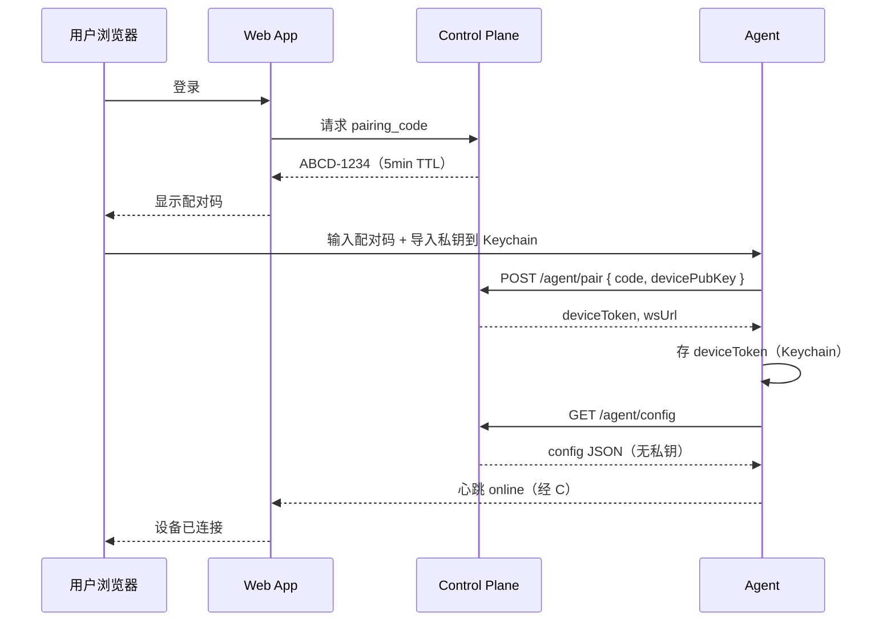
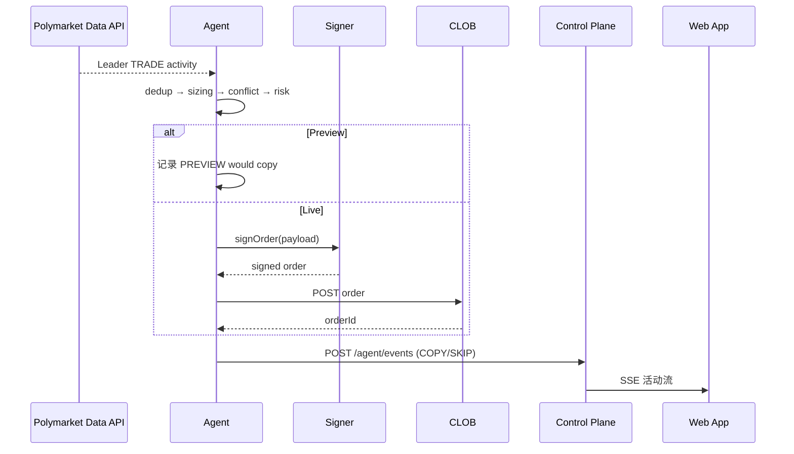

# Web + Agent 架构设计

> 版本：1.0 · 2026-06-27  
> 状态：规划文档（未全面实施）  
> 关联：[ECOSYSTEM_WORKFLOW.md](ECOSYSTEM_WORKFLOW.md) · [ARCHITECTURE.md](ARCHITECTURE.md) · [SECURITY.md](SECURITY.md)

---

## 1. 文档目的

定义 PolyMirror **网站化（Web）+ 本机 Agent** 的产品与技术架构，在 **平台不托管用户私钥** 的前提下，实现全自动 Live 跟单。

**核心原则：**

- **「不碰私钥」≠「不需要签名」** — Polymarket CLOB 要求订单 EIP-712 签名（见 [Polymarket Trading Overview](https://docs.polymarket.com/trading/overview)）。
- **「平台不碰私钥」= 签名发生在用户控制的 Agent 内**，云端只管理配置与可见性。

---

## 2. 设计目标与约束

| 目标 | 约束 |
|------|------|
| 网站化 UX（注册、多端、观察池） | 云端 **永不** 存储/传输 `POLYMARKET_PRIVATE_KEY` |
| 全自动 Live 跟单 | 签名必须在 Agent 内完成 |
| 低延迟 copy trading | 监听 + 决策尽量靠近 Agent |
| 与现 PolyMirror 兼容 | 渐进迁移，不推翻重写 |

### 2.1 明确禁止的云端能力

以下 API **不得存在**：

```
POST /api/wallet/private-key     ❌
POST /api/wallet/import-seed     ❌
POST /api/wallet/api-secret      ❌（完整 secret 不应经浏览器提交到云）
```

Web 注册/登录 **不** 收集钱包私钥。Live 全自动跟单 **不能** 仅靠用户把 API Key 交给 SaaS（官方要求订单仍需私钥签名）。

---

## 3. 信任模型对比

```
┌─────────────────────────────────────────────────────────────────┐
│ 模型 A：托管 SaaS（OkBet 类）                                      │
│   用户 ──→ 平台云 ──→ [私钥/KMS] ──→ 签名 ──→ Polymarket           │
│   平台：能签、能下单、理论上能转走资金                               │
└─────────────────────────────────────────────────────────────────┘

┌─────────────────────────────────────────────────────────────────┐
│ 模型 B：自托管引擎（PolyMirror v1.0 现路径）                        │
│   用户 ──→ 自己的 VPS/本机 ──→ [.env 私钥] ──→ 签名 ──→ Polymarket  │
│   代码发布方：若不运营用户引擎，则碰不到私钥                         │
└─────────────────────────────────────────────────────────────────┘

┌─────────────────────────────────────────────────────────────────┐
│ 模型 C：Web + Agent（本文档）                                      │
│   用户 ──→ polymirror.com（策略/UI）                              │
│              │                                                    │
│              └──→ 本机 Agent ──→ [Keychain/.env] ──→ 签名         │
│   平台：只收配置与事件，不收私钥                                     │
└─────────────────────────────────────────────────────────────────┘
```

| 模型 | 平台能否碰私钥 | 全自动 Live | 用户门槛 | PolyMirror 主线 |
|------|----------------|-------------|----------|-----------------|
| A 托管 SaaS | 能（或 KMS 代签） | ✅ | 低 | ❌ 与自托管定位冲突 |
| B 自托管引擎 | 不能（若不代运维） | ✅ | 中 | ✅ **当前** |
| C Web + Agent | 不能 | ✅ | 中～高 | ✅ **网站化方向** |

---

## 4. 总体架构（四层）

```
┌─────────────────────────────────────────────────────────────────┐
│ L4  用户界面层                                                    │
│     Web App (app.polymirror.com) · 可选移动端 · Telegram 入口     │
└───────────────────────────────┬─────────────────────────────────┘
                                │ HTTPS / WSS（无私钥）
┌───────────────────────────────▼─────────────────────────────────┐
│ L3  云端控制面（Control Plane）                                    │
│     账号 · 观察池 · 配置同步 · Preview 报告 · 设备配对              │
└───────────────────────────────┬─────────────────────────────────┘
                                │ 配对通道（设备 Token / mTLS）
┌───────────────────────────────▼─────────────────────────────────┐
│ L2  本机 Agent（Execution Plane）                                  │
│     监听 · 引擎 · 本地风控 · Signer · CLOB 提交                    │
└───────────────────────────────┬─────────────────────────────────┘
                                │ HTTPS（Data API + CLOB）
┌───────────────────────────────▼─────────────────────────────────┐
│ L1  Polymarket                                                   │
│     Data API · CLOB · 链上                                        │
└─────────────────────────────────────────────────────────────────┘
```

### 4.1 信任域

| 信任域 | 包含 | 私钥 |
|--------|------|------|
| **A — 用户设备（Agent）** | Signer、全量 SQLite、本地风控 | ✅ 仅在此域 |
| **B — PolyMirror Cloud** | 账号、配置 JSON、观察池、活动流副本 | ❌ |
| **C — 浏览器** | JWT、UI | ❌ |

---

## 5. 组件分解

### 5.1 云端 Web App（前端）

| 模块 | 职责 | 需私钥 |
|------|------|--------|
| 登录/注册 | 邮箱/OAuth | ❌ |
| 发现 Trader | 排行榜（可调云端缓存） | ❌ |
| 观察池 | 候选 → 观察 → Preview → Live | ❌ |
| Leader 配置 | 比例、限额、filters、冲突策略 | ❌ |
| 活动流（只读） | 订阅 Agent 上报的 DETECT/COPY/SKIP | ❌ |
| Preview 报告 | 7/14 天模拟统计 | ❌ |
| 设备管理 | 配对 Agent、在线状态、版本 | ❌ |
| Live 开关 | 发 **意图** 给 Agent，Agent 本地二次确认 | ❌ |

**不做：** 下单签名、存 `.env`、替用户直连 CLOB 下单。

### 5.2 云端 Control Plane（后端 API）

| 服务 | 职责 | 存储数据 |
|------|------|----------|
| Auth | 用户会话、JWT | 无钱包密钥 |
| Config Sync | `config.yaml` 逻辑结构的 JSON 版 | 无密钥 |
| Watchlist | 观察池状态机、标签、备注 | 无密钥 |
| Device Registry | 设备 ID、设备公钥、心跳 | 设备 Token，非钱包私钥 |
| Event Ingest | Agent 上报活动流、PnL 摘要 | 无密钥 |
| Preview Engine（可选） | 云端用公开 Data API 重放历史 | 无密钥 |
| Notification Router | TG/邮件（内容来自 Agent 上报） | 无密钥 |

### 5.3 本机 Agent

```
PolyMirror Agent
├── agent-core/          # 进程生命周期、更新、日志
├── pairing/             # 与云端配对、设备 Token
├── config-local/        # 拉取云端配置 + 本地覆盖 + 热重载
├── monitor/             # Leader 轮询/WS（复用 src/monitor）
├── engine/              # 去重、缩放、冲突、风控（复用 src/engine）
├── signer/              # ★ 私钥仅在此模块
├── executor/            # CLOB 提交（复用 src/executor）
├── state/               # 本地 SQLite（复用 src/state）
├── uplink/              # 向云端上报状态/活动流
└── local-api/           # 可选：127.0.0.1 本地调试 Dashboard
```

#### Signer 模块（密钥边界）

```
┌─────────────────────────────────────┐
│ Signer（唯一可接触私钥的模块）         │
│  ├── loadKey() → OS Keychain / .env  │
│  ├── signOrder(payload) → signature  │
│  ├── signClobAuth() → L1 派生        │
│  └── 禁止将 key 写入日志              │
└─────────────────────────────────────┘
         ↑ 仅 executor 通过接口调用
         ✗ monitor/engine/uplink 不可直接读 key
```

---

## 6. Agent 运行模式

### 6.1 C1：Agent 主导（推荐 Live 默认）

```
Leader 成交
  → Agent.monitor（本地轮询/WS）
  → Agent.engine（本地 COPY/SKIP）
  → Agent.signer + executor（本地签名下单）
  → Agent.uplink（结果上报云端）
  → Web 展示活动流
```

| 项 | 说明 |
|----|------|
| 云端角色 | 配置中心 + 展示 + 配对 |
| 云端断线 | **仍可跟单**（Agent 用本地 config 缓存） |
| 延迟 | 最低 |
| 与现 PolyMirror | ≈ 现有 daemon + `uplink` + `pairing` |

### 6.2 C2：云端算策略 + Agent 只签名

```
Leader 成交
  → Cloud.monitor（云端轮询）
  → Cloud.engine → 生成 SignIntent
  → WSS 推送到 Agent
  → Agent 本地校验 → sign → POST CLOB
```

| 项 | 说明 |
|----|------|
| 云端断线 | **不能跟单** |
| 延迟 | 多一跳 RTT |
| 适用 | Preview 重算、轻 Agent；Live 不推荐为主路径 |

**产品建议：** Live 用 **C1**；Preview 可用云端模拟或 C2。

---

## 7. 数据流

### 7.1 配置下行（Cloud → Agent）

```
用户 Web 改 Leader 比例 10% → 5%
    │
    ▼
Control Plane 保存 config_v3（JSON）
    │
    ▼
WSS push 或 Agent GET /agent/config?version=42
    │
    ▼
Agent config-local 校验 → 写本地 cache → 热重载 engine
    │
    ▼
ACK { version: 42, appliedAt }
```

配置 JSON 可含：`leaders[]`、`global.risk`、`preview_mode`。  
**不可含：** `privateKey`、`apiSecret`。

Agent 本地 `agent.secrets`（Keychain）与云端 config **分离存储**。

### 7.2 交易上行（Agent → Cloud → Web）

```
Agent COPY 成功
    │
    ▼
POST /agent/events/batch
{
  "type": "COPY",
  "leaderId": "whale_a",
  "market": "...",
  "side": "BUY",
  "sizeUsd": 12.5,
  "price": 0.62,
  "orderId": "...",
  "mode": "live",
  "ts": 1719000000
}
    │
    ▼
Cloud 存时序 → Web SSE 推送给用户
```

### 7.3 Live 开启（双确认）

```
Web: 用户点「开启 Live」
    │
    ▼
Cloud: 写 live_intent { preview_mode: false }
    │
    ▼
Agent 收到 intent
    ├── 本地：POLYMIRROR_LIVE_CONFIRM 等价检查
    ├── 本地：余额、geoblock、deposit wallet 就绪
    └── Agent UI / 系统通知：「确认 Live？」
            ├── 用户确认 → 本地 preview_mode=false
            └── 拒绝 → 保持 Preview，上报 rejected
    │
    ▼
Web：显示 Live 已启用（Agent 确认时间）
```

**Web 点 Live ≠ 直接 Live。** 防云端账号被盗后直接开实盘。

### 7.4 C1 订单签名流

```
engine 决定 COPY
    │
    ▼
build PlaceOrderRequest
    │
    ▼
risk.gate（本地最后一关）
    │
    ▼
signer.signOrder(request)     ← 私钥仅在 Signer
    │
    ▼
executor.postOrder(signed) → CLOB
    │
    ▼
state SQLite + uplink 上报
```

与现 `copy-cycle.ts` → `ClobExecutor` 路径一致；重构点为 `Wallet(privateKey)` → `OrderSigner` 接口。

---

## 8. C1 时序图

### 8.1 设备配对



### 8.2 Live 跟单一笔（C1）



---

## 9. 接口设计

### 9.1 OrderSigner（PolyMirror 内部重构）

目标：`executor` 只依赖接口，不直接 `new Wallet(privateKey)`。

```typescript
/** 订单签名抽象 — 私钥仅存在于 Signer 实现内 */
interface OrderSigner {
  readonly eoaAddress: string;
  readonly proxyAddress: string;
  readonly signatureType: number;

  /** L2 API 凭证（L1 在 Agent 内完成） */
  ensureApiCredentials(): Promise<ApiKeyCreds>;

  /** EIP-712 订单签名 */
  signOrder(payload: UnsignedOrder): Promise<SignedOrder>;

  /** 健康检查，不暴露 key 材料 */
  health(): Promise<{ ok: boolean; address: string }>;
}

// EnvFileSigner     — 现 .env 逻辑（自托管单机 / 迁移期）
// KeychainSigner    — Agent 默认（macOS / Windows / Linux）
// RemoteSigner      — 不推荐；仅 C2 实验
```

现 `getSecureClient(wallet)` 逐步改为接受 `OrderSigner`，而非在多处传递 `wallet.privateKey` 字符串。

### 9.2 Agent ↔ Cloud REST API（草案）

Base URL: `https://api.polymirror.example`（示例）

#### 配对

```http
POST /v1/agent/pair
Content-Type: application/json

{
  "pairingCode": "ABCD-1234",
  "devicePubKey": "0x...",
  "agentVersion": "2.0.0",
  "platform": "darwin-arm64"
}

→ 200
{
  "deviceToken": "…",
  "deviceId": "…",
  "wsUrl": "wss://ws.polymirror.example/v1/agent",
  "userId": "…"
}
```

#### 心跳

```http
GET /v1/agent/health
Authorization: Bearer <deviceToken>

→ 200
{
  "agentVersion": "2.0.0",
  "previewMode": true,
  "leadersEnabled": 3,
  "lastCopyAt": "2026-06-27T10:00:00Z",
  "uptimeSec": 86400
}
```

#### 配置拉取

```http
GET /v1/agent/config
Authorization: Bearer <deviceToken>
If-None-Match: "v42"

→ 200 / 304
{
  "version": 42,
  "previewMode": true,
  "leaders": [ … ],
  "global": { "risk": … }
}
```

#### 事件批量上报

```http
POST /v1/agent/events/batch
Authorization: Bearer <deviceToken>
Content-Type: application/json

{
  "accountId": "default",
  "events": [
    {
      "type": "COPY",
      "ts": 1719000000,
      "payload": { … }
    }
  ]
}
```

### 9.3 WSS 下行（Control Plane → Agent）

```json
{ "op": "config_updated", "version": 43 }
{ "op": "live_intent", "previewMode": false, "requestedAt": "…", "cloudSig": "…" }
{ "op": "kill_switch", "active": true }
```

Agent 对 `live_intent` **不得盲执行**，须本地策略 + 用户确认（§7.3）。

### 9.4 SignIntent（仅 C2）

```typescript
interface SignIntent {
  intentId: string;
  leaderId: string;
  tokenId: string;
  side: "BUY" | "SELL";
  price: number;
  size: number;
  notionalUsd: number;
  issuedAt: number;
  cloudSignature: string; // Control Plane 对 intent 签名
}
```

---

## 10. Agent 本地风控（C2 必做，C1 建议保留）

对任何待签名请求（含 C2 SignIntent）校验：

| # | 规则 |
|---|------|
| 1 | `leaderId` ∈ 本地 `enabled` leaders |
| 2 | `notionalUsd` ≤ 本地 `max_order` + 日累计限额 |
| 3 | `tokenId` / market 不在本地 blocklist |
| 4 | `preview_mode === false` 才 POST CLOB |
| 5 | Kill Switch 本地 active → 拒签 |
| 6 | intent 时间戳在 ±60s 内 |
| 7 | C2：`cloudSignature` 用配对时存的 Cloud 公钥验证 |

即使云端被入侵，Agent 也不应签明显越权单。

---

## 11. 私钥存储（Agent 内）

| 方案 | 适用 | 说明 |
|------|------|------|
| **OS Keychain** | 桌面 Agent 推荐 | Keychain / DPAPI / libsecret |
| **加密文件** | 进阶用户 | `agent.vault` + 启动密码 |
| **`.env` 明文** | 迁移期 | 与 v1.0 自托管相同；文档标注风险 |
| **硬件钱包** | 一般不推荐跟单 | 延迟高，不适合毫秒～秒级跟单 |

**首次配对：**

```
Agent 安装 → 「导入 Polymarket 私钥」→ 仅写入 Keychain
           → 可选：从现有 PolyMirror .env 迁移
           → Web 永远不参与此步骤
```

---

## 12. 与现 PolyMirror 模块映射

| 现有模块 | Web + Agent 归属 | 改动 |
|----------|------------------|------|
| `src/monitor/` | Agent（C1）或 Cloud（C2） | C1 基本不动 |
| `src/engine/` | Agent（C1）或 Cloud（C2） | 抽纯函数便于云端 Preview |
| `src/executor/` | **仅 Agent** | 接 `OrderSigner` |
| `src/state/` | Agent 主 + Cloud 存摘要 | 全量 SQLite 留本地 |
| `src/api/` + `dashboard/` | Cloud Web + Agent `local-api` | 认证改用户 JWT |
| Preview | Cloud 或 Agent | 零 key 优先 Cloud |

### 12.1 与方案 B（现自托管）关系

| | 方案 B（v1.0） | 方案 C（Web+Agent） |
|--|----------------|---------------------|
| 引擎位置 | 用户机器 | 用户机器（Agent） |
| UI | `127.0.0.1` Dashboard | `app.polymirror.com` |
| 私钥 | `.env` | Keychain / `.env` |
| 多设备看数据 | 难 | 易（云端同步活动流） |

**C 不是替代 B，是 B 的产品化上层：** Agent 内核可以是 PolyMirror daemon 的演进包。

---

## 13. 部署形态

### 13.1 用户侧 Agent

| 形态 | 平台 | 说明 |
|------|------|------|
| CLI Agent | Linux VPS | 现 `npm run dev` 演进；用户 **自购** VPS |
| Docker Agent | NAS/VPS | 用户自托管，非平台代运维 |
| 桌面 Agent | Win/macOS | Tauri/Electron 托盘 + 后台 daemon |
| 浏览器扩展 | Chrome | 宜配合 Native Host；监听建议仍在 Native |

用户自购 VPS 跑 Agent 仍属 **用户信任域**，平台不碰私钥。

### 13.2 平台侧 Cloud（由 PolyMirror 运营）

| 服务 | 示例主机名 |
|------|------------|
| Web SPA | `app.polymirror.example` |
| Control Plane API | `api.polymirror.example` |
| Agent WebSocket | `ws.polymirror.example` |

**不部署：** 带用户私钥的 execution worker（除非转向托管 SaaS 模型 A）。

---

## 14. 分功能：是否需要私钥

| 功能 | Agent | Cloud Web | 纯 Cloud 无 Agent |
|------|-------|-----------|-------------------|
| 发现 Trader / 观察池 | ❌ | ❌ | ❌ |
| Preview 模拟 | ❌* | ❌ | ❌ |
| Leader 监听 | ❌* | ❌ | ❌ |
| Live 下单 | ✅ | ❌ | ❌ |
| 看 Leader 公开成交 | ❌ | ❌ | ❌ |

\*C1：监听在 Agent，无需把 key 给 Cloud。C2：Cloud 可监听 Leader，但下单仍要 Agent。

---

## 15. 威胁模型摘要

| 攻击场景 | 后果 | 缓解 |
|----------|------|------|
| Cloud DB 泄露 | 配置、活动流泄露 | 无 key；专用小额钱包 |
| 用户 Cloud 账号被盗 | 改配置、发 Live intent | Agent 本地二次确认 |
| Cloud 恶意 SignIntent（C2） | 诱导签错单 | Agent 本地七条校验 |
| Agent 机器被黑 | 私钥泄露 | 专用钱包、Kill Switch、最小权限 |
| 假 Agent 钓鱼 | 用户把 key 输入假 App | 代码签名、官方下载渠道 |
| Dashboard/API 暴露公网（现 v1.0） | 改 Live 配置 | `DASHBOARD_TOKEN`、见 [SECURITY.md](SECURITY.md) |

---

## 16. Polymarket 签名约束（必读）

| 层级 | 用途 | 材料 |
|------|------|------|
| L1 | 创建/派生 API 凭证 | 私钥签 EIP-712 |
| L2 | 请求鉴权 HMAC | apiKey + secret + passphrase |
| 下单 | 订单 payload | **仍要私钥签 EIP-712** |

参考：[Polymarket Authentication](https://docs.polymarket.com/api-reference/authentication) · [Trading Overview](https://docs.polymarket.com/trading/overview)

PolyMirror 现 Live 路径（`src/executor/secure-client.ts`）使用 `Wallet(privateKey)`，与官方模型一致。

**Deposit wallet（POLY_1271）** 等复杂签名类型仍须在 Agent 内处理；见 `.env.example` 与 [clob-client-v2#65](https://github.com/Polymarket/clob-client-v2/issues/65)。

---

## 17. 实施路线图

### Phase 0：接口预埋（约 1～2 周）

- [ ] 定义 `OrderSigner` 接口
- [ ] `ClobExecutor` / `getSecureClient` 改走 Signer
- [ ] `EnvFileSigner` = 现逻辑，行为不变

### Phase 1：Agent MVP（约 2～4 周）

- [ ] `polymirror-agent` CLI 包（= 现 daemon + 结构化 Agent 入口）
- [ ] Keychain 存私钥（可选回退 `.env`）
- [ ] 本地 Dashboard 仍可用（`local-api`）
- [ ] 文档：Agent = 自托管升级版

### Phase 2：Cloud Control Plane（约 4～8 周）

- [ ] 用户 Auth + 设备配对
- [ ] Config Sync（C1）
- [ ] 活动流 uplink + Web 只读
- [ ] 观察池状态机（见 [ECOSYSTEM_WORKFLOW.md](ECOSYSTEM_WORKFLOW.md)）

### Phase 3：Web 产品化（约 4～6 周）

- [ ] 托管 Web Dashboard 前端
- [ ] 云端 Preview 报告（零 key）
- [ ] Live 双确认流程

### Phase 4（可选）：C2 SignIntent

- 仅在有「轻 Agent」明确需求时实施

---

## 18. 用户旅程（端到端）

```
1. 浏览器注册 app.polymirror.example
2. Web：观察池添加 Leader（云端）
3. 下载 Agent → pairing_code 配对 → 私钥进 Keychain
4. Web：配置 Leader 10% → 同步至 Agent
5. Web：开 Preview → Agent preview_mode=true
6. 7 天后 Web 看 Preview 报告
7. Web：申请 Live → Agent 弹窗确认 → Live
8. 手机 Web 看活动流；Agent 在用户 VPS 24h 运行
```

与 [ECOSYSTEM_WORKFLOW.md](ECOSYSTEM_WORKFLOW.md) 中 Predicts.guru → PolyWallet → PolyMirror 流程一致；Web 负责配置与可见性，Agent 负责执行。

---

## 19. 常见误解

| 误解 | 事实 |
|------|------|
| 「用 API Key 就不用私钥」 | 自动下单仍要签订单 |
| 「不碰私钥 = 不能交易」 | 可在用户 Agent 内签，平台不碰 |
| 「自托管 = 不能网站化」 | UI 可云端，引擎在 Agent |
| 「Agent = 把 key 给平台」 | key 在 Agent，平台只发配置/intent |
| 「Preview 没用」 | 零 key 体验 + 内容转化 + 云端可托管 |

---

## 20. 相关文档

- [ECOSYSTEM_WORKFLOW.md](ECOSYSTEM_WORKFLOW.md) — 生态分工与功能规划
- [ARCHITECTURE.md](ARCHITECTURE.md) — v1.0 模块与数据流
- [SECURITY.md](SECURITY.md) — 威胁模型与 Dashboard 鉴权
- [DEVELOPMENT_PLAN.md](DEVELOPMENT_PLAN.md) — 技术里程碑
- [dashboard/01-overview.md](dashboard/01-overview.md) — 现 Dashboard 推荐流程

---

**免责声明：** PolyMirror 为跟单执行与风控工具，不构成投资建议。Web + Agent 架构旨在减少平台托管私钥的风险，**不能**消除预测市场亏损、Agent 设备被入侵或用户操作失误等风险。请使用专用小额钱包并先在 Preview 模式下充分验证。
